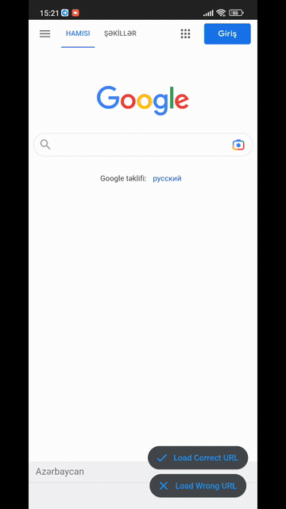

# Project to get special error messages for web browser in Flutter. In this project, the Offline error screen and the method of getting the error screen according to the HTTP errors received are explained.

- Special offline screen
- Special  HTTP error screen
- Double tap to exit app
- Dark & Light Theme
- Pull to Refresh Page
- Colored Circular Progress Indicator
- 🛡️ Null safety

# Screenshoot

